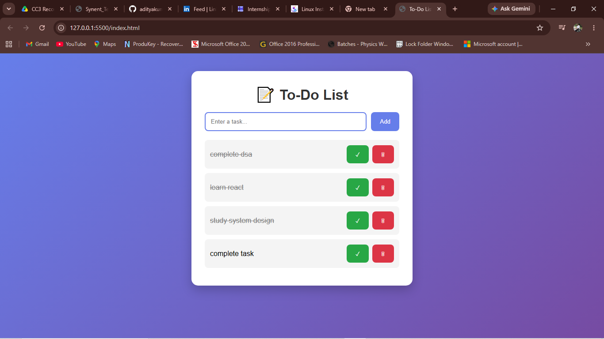

# 📝 To-Do List Web App

A simple and responsive To-Do List Web Application built using **HTML, CSS, and JavaScript**. This project helps users manage their daily tasks efficiently by allowing them to add, complete, and delete tasks. The application uses **Local Storage** to persist data, ensuring that tasks remain available even after refreshing or reopening the browser.

---

## 📌 Project Overview

The To-Do List Web App is a task management application designed to improve productivity and organization. Users can create tasks, track their completion status, and remove tasks when no longer needed.

The application stores all task data in the browser's local storage, eliminating the need for a backend database while providing persistent data storage.

---

## 🎯 Objectives

* Develop a task management application using core web technologies.
* Implement CRUD-like task operations.
* Learn JavaScript DOM Manipulation.
* Understand browser Local Storage.
* Create a responsive and user-friendly interface.

---

## 🚀 Features

### ✅ Add Task

Users can enter a task and add it to the list.

### ✅ Mark Task as Completed

Tasks can be marked as completed with a single click.

### ✅ Delete Task

Users can remove tasks that are no longer required.

### ✅ Local Storage Support

All tasks are stored in the browser's local storage.

### ✅ Data Persistence

Tasks remain available even after refreshing the page.

### ✅ Responsive Design

Works seamlessly across desktop, tablet, and mobile devices.

---

## 🛠️ Technologies Used

| Technology        | Purpose                            |
| ----------------- | ---------------------------------- |
| HTML5             | Structure of the application       |
| CSS3              | Styling and responsiveness         |
| JavaScript (ES6)  | Functionality and DOM manipulation |
| Local Storage API | Persistent data storage            |

---

## 📂 Project Structure

```text
ToDo-App/
│
├── index.html
├── style.css
├── script.js
├── screenshots/
└── README.md
```

---

## ⚙️ Methodology

### Step 1: User Interface Design

Created a clean and intuitive user interface using HTML and CSS.

Components:

* Input field for entering tasks
* Add button
* Task list container
* Complete button
* Delete button

### Step 2: Task Creation

Implemented JavaScript functionality to:

* Read user input
* Validate empty entries
* Create task objects
* Display tasks dynamically

### Step 3: Task Completion

Added functionality to:

* Toggle task completion status
* Apply visual styling for completed tasks

### Step 4: Task Deletion

Implemented deletion functionality:

* Remove task from UI
* Update Local Storage automatically

### Step 5: Local Storage Integration

Stored task data using:

```javascript
localStorage.setItem("tasks", JSON.stringify(tasks));
```

Retrieved task data using:

```javascript
JSON.parse(localStorage.getItem("tasks"));
```

### Step 6: Data Persistence

Loaded all saved tasks automatically when the application starts.

---

## 🔄 Workflow

```text
User Enters Task
        │
        ▼
Click Add Button
        │
        ▼
Task Stored in Local Storage
        │
        ▼
Task Displayed on Screen
        │
 ┌──────┴──────┐
 ▼             ▼
Complete     Delete
Task         Task
 ▼             ▼
Update      Remove
Storage     Storage
```

---

## 📊 Functional Requirements

### Input Validation

* Empty tasks are not allowed.
* User receives feedback if input is blank.

### Task Management

* Create task
* Update task status
* Delete task

### Storage Management

* Save tasks
* Retrieve tasks
* Update stored data

---

## 📈 Results

The project successfully achieved all intended objectives:

✔ Users can add tasks.

✔ Users can mark tasks as completed.

✔ Users can delete tasks.

✔ Tasks persist after page refresh.

✔ Data is stored locally without requiring a database.

✔ Responsive layout improves user experience across devices.

---

## 🔍 Learning Outcomes

Through this project, the following concepts were learned and applied:

* HTML Page Structure
* CSS Styling and Responsive Design
* JavaScript Event Handling
* DOM Manipulation
* Arrays and Objects
* Local Storage API
* Dynamic Content Rendering
* User Interface Design Principles

---

## 📸 Screenshots


